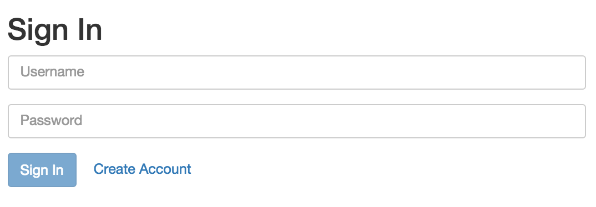

#Trello Clone Built with MEAN Stack

NOTE: This app is created purely for academic purposes.

##Description
Trello Clone first started as a simple todo-list app that many new developers are familiar with. This app allows the user to create a board and multiple lists of todo-items within the board. The user may also invite a member (another user) to the board he/she created and let the member have access to the contents of the board. Once user has access to the board, he/she is free to make how many board/lists/todo items as he/she pleases.

##Technology Stack
* MongoDB with Mongoose
* Node with Express
* Angular

##General Setup (Required)
* Clone the repo
* Checkout the master branch
* cd to 'mytodoupgrade' folder
* install npm if you haven't. Follow instrucions [here](https://docs.npmjs.com/getting-started/installing-node){:target="_blank"}
* install MongoDB, Follow instructions [here](https://www.npmjs.com/package/mongodb){:target="_blank"}
* npm install
* cd to 'mytodo' folder
* npm install
* bower install (has to be done while in 'mytodo' folder)

Make sure you have all of the directories in todo-angular-mongoose.
Follow the next instructions in order.

#####Running MongoDB:
Open a new terminal window, run 'mongod' on it. This app uses database called 'todos'. After having mongod and mongo running, select the window in which you are running 'mongo' and select todos as your database.

#####Server Side:
Navigate all the way to 'mytodoupgrade' folder. This folder contains all of the server side code of the app. Type and enter 'node app.js' and if you are successful, you should get the following message in your terminal: 'Listening to port 3000'

#####Client Side: 
Navigate all the way to 'mytodo' folder. This folder contains all of the client side code of the app. Type and enter 'gulp serve' and if you are successful, you should see the app running in your default browser with the following page rendered:

##How To Run Tests:

#####Express Tests:
If you haven't, navigate all the way to 'mytodoupgrade' folder in your terminal. Type in 'jasmine' to run all the spec files within the directory. 

######WARNING: 
*Tests will not run if your node server is running. If you are running 'node app.js', Ctrl+C in order to kill the server.
*If you previously executed the tests (especially with code before this update), remove existing data from database. One way is to completely dropping the database and recreating it, or typing in separately: db.users.remove({}), db.boards.remove({}), db.lists.remove({}), db.todos.remove({})

#####Angular Tests:
If you haven't, navigate all the way to 'mytodo' folder in your terminal. Then run 'gulp test.'
